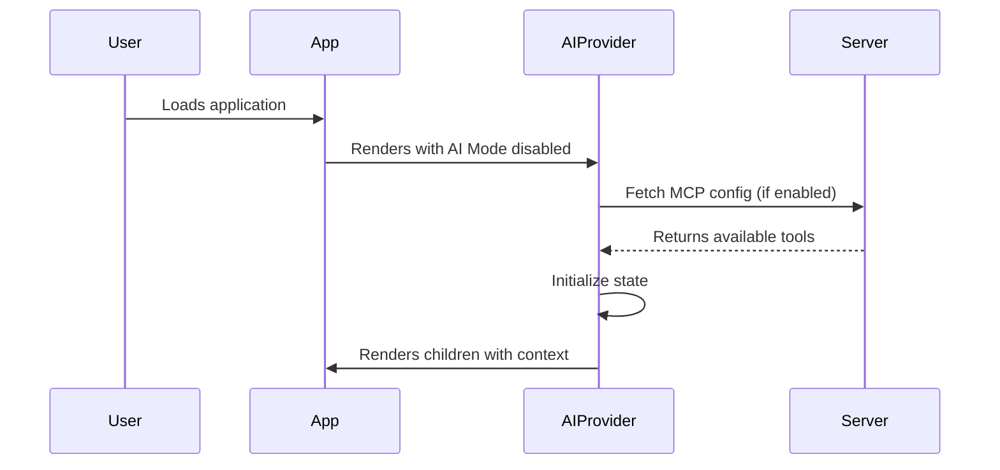
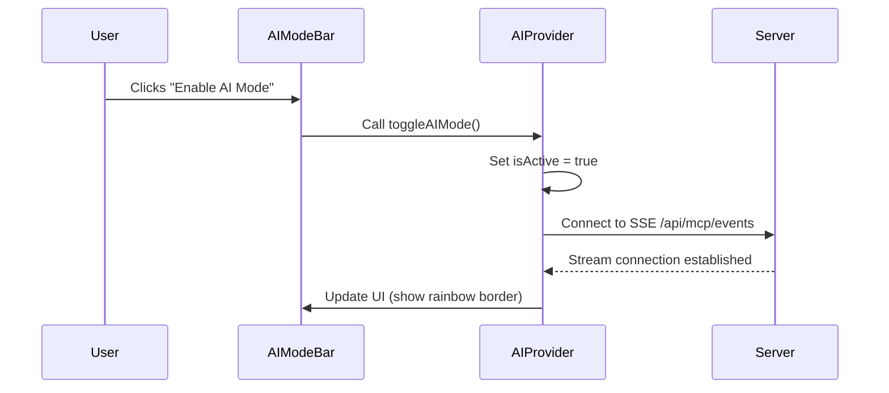
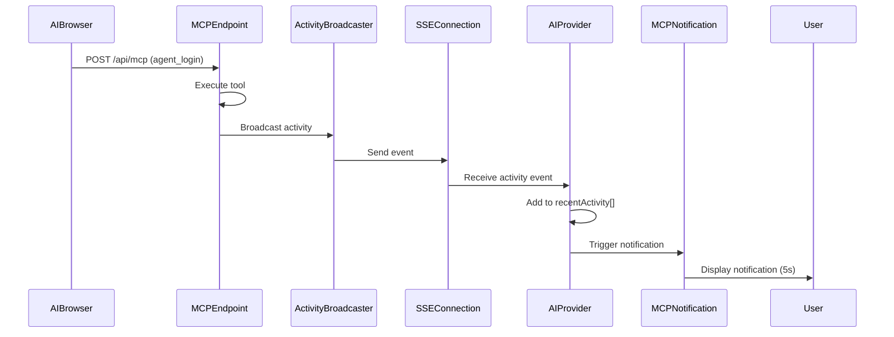

# AI Mode Technical Specification

## Overview

AI Mode is a client-side feature that provides users with real-time visibility into AI browser interactions with MCP (Model Context Protocol) servers. It creates an immersive, secure visual layer that shows when AI agents are accessing protected resources through auth-sdk's MCP Shield.

**Next.js 16 Compatibility**: AI Mode is designed for Next.js 16+ which introduces the Proxy feature (formerly middleware) and enhanced streaming capabilities. The implementation leverages Node.js runtime for SSE support and integrates seamlessly with Next.js 16's native MCP DevTools.

## Problem Statement

Developers need to:
1. **Inform users** when AI browsers/agents are interacting with their application
2. **Build trust** by showing which MCP tools are being accessed
3. **Provide transparency** around AI-delegated authentication
4. **Enhance security awareness** by making AI operations visible

Currently, auth-sdk provides backend MCP security (MCP Shield) but lacks client-side visualization for end users.

## Goals

### Primary Goals
- Create a non-intrusive visual indicator when AI Mode is active
- Display available MCP tools that the application exposes
- Show real-time notifications when AI browsers use MCP tools
- Provide a secure, opt-in mechanism for users to enable AI Mode

### Secondary Goals
- Integrate seamlessly with existing Next.js 16 applications
- Support both light and dark themes
- Maintain performance with minimal bundle size impact
- Provide analytics/telemetry for MCP usage patterns

## Architecture

### High-Level Components

```
┌─────────────────────────────────────────────────────────┐
│                    User's Browser                        │
│  ┌───────────────────────────────────────────────────┐  │
│  │           Application View                         │  │
│  │  ┌─────────────────────────────────────────────┐  │  │
│  │  │                                              │  │  │
│  │  │         User's Application Content           │  │  │
│  │  │                                              │  │  │
│  │  │  ┌────────────────────────────────────┐    │  │  │
│  │  │  │  Rainbow Border (when AI active)   │    │  │  │
│  │  │  └────────────────────────────────────┘    │  │  │
│  │  └─────────────────────────────────────────────┘  │  │
│  │                                                     │  │
│  │  ┌─────────────────────────────────────────────┐  │  │
│  │  │  AI Mode Bar (Bottom)                       │  │  │
│  │  │  ┌─────────────────────────────────────┐   │  │  │
│  │  │  │  🤖 AI Mode Active                   │   │  │  │
│  │  │  │  Available MCPs: 3                   │   │  │  │
│  │  │  │  [agent_login] [get_session] [...]  │   │  │  │
│  │  │  └─────────────────────────────────────┘   │  │  │
│  │  │                                             │  │  │
│  │  │  ┌────────────────────────────────────┐    │  │  │
│  │  │  │  🔔 AI used: agent_login            │    │  │  │
│  │  │  │  User: demo-user-123                │    │  │  │
│  │  │  │  Scopes: debug, read                │    │  │  │
│  │  │  │  (auto-dismiss after 5s)            │    │  │  │
│  │  │  └────────────────────────────────────┘    │  │  │
│  │  └─────────────────────────────────────────────┘  │  │
│  └───────────────────────────────────────────────────┘  │
└─────────────────────────────────────────────────────────┘
```

### Component Breakdown

#### 1. AI Mode Provider (`AIProvider`)
**Location**: `src/hooks/useAIMode.tsx`

```typescript
interface AIProviderProps {
  children: ReactNode;
  mcpEndpoint?: string;        // Default: "/api/mcp"
  enabled?: boolean;            // Default: false (opt-in)
  position?: "bottom" | "top"; // Default: "bottom"
  theme?: "auto" | "light" | "dark";
}

interface AIModeContext {
  isActive: boolean;
  availableTools: MCPToolInfo[];
  recentActivity: MCPActivity[];
  toggleAIMode: () => void;
  clearActivity: () => void;
}
```

**Responsibilities**:
- Manage AI Mode state (enabled/disabled)
- Fetch available MCP tools from the server
- Listen for MCP tool usage events via WebSocket or Server-Sent Events (SSE)
- Provide context to child components

#### 2. AI Mode Bar (`AIModeBar`)
**Location**: `src/components/AIModeBar.tsx`

Visual bar displayed at the bottom (or top) of the viewport showing:
- AI Mode toggle button
- Count of available MCP tools
- List of available tools with icons
- Recent activity notifications

**Features**:
- Collapsible/expandable
- Sticky positioning (fixed to viewport)
- Minimal height when collapsed (~40px)
- Expanded view shows tool cards (~200px height)

#### 3. Rainbow Border Effect
**Location**: `src/components/RainbowBorder.tsx`

Animated gradient border around the viewport when AI Mode is active.

```css
.rainbow-border {
  position: fixed;
  top: 0;
  left: 0;
  right: 0;
  bottom: 0;
  pointer-events: none;
  border: 3px solid transparent;
  background: linear-gradient(white, white) padding-box,
              linear-gradient(90deg, #ff0000, #ff7f00, #ffff00, #00ff00, #0000ff, #4b0082, #9400d3) border-box;
  animation: rainbow-rotate 3s linear infinite;
}

@keyframes rainbow-rotate {
  to { filter: hue-rotate(360deg); }
}
```

#### 4. MCP Activity Notification (`MCPNotification`)
**Location**: `src/components/MCPNotification.tsx`

Card-style notification that appears above the AI Mode Bar when a tool is used.

```typescript
interface MCPNotification {
  id: string;
  toolName: string;
  timestamp: number;
  metadata: {
    userId?: string;
    scopes?: string[];
    agentId?: string;
    duration?: number;
  };
  type: "success" | "error" | "warning";
}
```

**Behavior**:
- Slide-in animation from bottom
- Auto-dismiss after 5 seconds
- Stack multiple notifications
- Click to dismiss manually

#### 5. MCP Tool Card (`MCPToolCard`)
**Location**: `src/components/MCPToolCard.tsx`

Individual card showing details about an available MCP tool.

```typescript
interface MCPToolInfo {
  name: string;
  description: string;
  icon?: string;
  usageCount?: number;
  lastUsed?: Date;
}
```

### Server-Side Components

#### 1. AI Mode Configuration Endpoint
**Location**: `examples/next-mcp-example/app/api/mcp/config/route.ts`

```typescript
// GET /api/mcp/config
{
  "tools": [
    {
      "name": "agent_login",
      "description": "Login as user for scoped agent access",
      "enabled": true,
      "scopes": ["debug", "read", "admin"]
    },
    {
      "name": "get_session",
      "description": "Get current session information",
      "enabled": true
    },
    {
      "name": "revoke_token",
      "description": "Revoke an agent token",
      "enabled": true
    }
  ],
  "aiModeEnabled": true,
  "analytics": {
    "enabled": true
  }
}
```

#### 2. MCP Activity Stream
**Location**: `examples/next-mcp-example/app/api/mcp/events/route.ts`

Server-Sent Events (SSE) endpoint for real-time MCP activity.

```typescript
// GET /api/mcp/events
// Returns SSE stream using Next.js 16 Route Handler streaming
export const runtime = 'nodejs'; // Required for SSE support

export async function GET(request: Request) {
  const stream = new ReadableStream({
    async start(controller) {
      // Send SSE events
      const encoder = new TextEncoder();
      const sendEvent = (event: string, data: any) => {
        controller.enqueue(encoder.encode(`event: ${event}\n`));
        controller.enqueue(encoder.encode(`data: ${JSON.stringify(data)}\n\n`));
      };

      // Example event
      sendEvent('mcp-usage', {
        toolName: 'agent_login',
        timestamp: new Date().toISOString(),
        userId: 'user-123',
        agentId: 'claude-agent',
        scopes: ['debug', 'read'],
        duration: 245
      });
    }
  });

  return new Response(stream, {
    headers: {
      'Content-Type': 'text/event-stream',
      'Cache-Control': 'no-cache',
      'Connection': 'keep-alive',
    },
  });
}
```

**Important Next.js 16 Notes**:
- Must use `runtime = 'nodejs'` (default) for streaming support
- Edge runtime does NOT support long-lived connections
- Proxy (middleware) cannot be used for SSE endpoints

#### 3. Enhanced MCP Route Handler
**Location**: Modify `examples/next-mcp-example/app/api/mcp/route.ts`

Add activity tracking to existing MCP endpoint:

```typescript
export async function POST(request: Request) {
  const secret = process.env.AUTH_SECRET!;
  const tools = createMCPTools({ secret });
  const body = await request.json().catch(() => ({}) as any);
  const { tool, args } = body || {};

  // ... existing validation ...

  const start = Date.now();
  const result = await tools[tool].execute(args || {});
  const duration = Date.now() - start;

  // Broadcast to AI Mode listeners
  await broadcastMCPActivity({
    toolName: tool,
    timestamp: new Date().toISOString(),
    metadata: args,
    duration,
    result: result.success ? "success" : "error"
  });

  return Response.json(result, { status: 200 });
}
```

## Data Flow

### 1. Initialization Flow



### 2. Enabling AI Mode



### 3. MCP Tool Usage Flow



## Implementation Phases

### Phase 1: Core UI Components (Week 1)
**Status**: Not Started

**Tasks**:
- [ ] Create `useAIMode` hook and `AIProvider` context
- [ ] Implement `AIModeBar` component
- [ ] Implement `RainbowBorder` component
- [ ] Implement `MCPNotification` component
- [ ] Implement `MCPToolCard` component
- [ ] Add TypeScript types and interfaces
- [ ] Write unit tests for components

**Deliverables**:
- Working UI components (non-functional, no backend integration)
- Storybook stories for each component
- Unit test coverage > 80%

### Phase 2: Server Integration (Week 2)
**Status**: Not Started

**Tasks**:
- [ ] Create `/api/mcp/config` endpoint
- [ ] Implement SSE endpoint `/api/mcp/events`
- [ ] Add activity broadcasting to existing MCP route
- [ ] Create `ActivityBroadcaster` utility class
- [ ] Implement connection management (reconnect logic)
- [ ] Add authentication checks for AI Mode endpoints
- [ ] Write integration tests

**Deliverables**:
- Functional server endpoints
- Real-time activity streaming
- Integration test coverage

### Phase 3: Next.js 16 Integration (Week 3)
**Status**: Not Started

**Tasks**:
- [ ] Update `examples/next-mcp-example` with AI Mode
- [ ] Create example page with AI Mode enabled
- [ ] Add documentation for Next.js setup
- [ ] Test with Next.js 16 Proxy
- [ ] Optimize bundle size
- [ ] Add performance monitoring

**Deliverables**:
- Working Next.js example app
- Setup documentation
- Performance benchmarks

### Phase 4: Analytics & Telemetry (Week 4)
**Status**: Not Started

**Tasks**:
- [ ] Add Warpy Cloud integration for AI Mode metrics
- [ ] Track AI Mode enablement rate
- [ ] Track MCP tool usage patterns
- [ ] Create dashboard for AI Mode analytics
- [ ] Add privacy controls for telemetry
- [ ] GDPR compliance review

**Deliverables**:
- Analytics integration
- Privacy policy updates
- Admin dashboard

### Phase 5: Polish & Launch (Week 5)
**Status**: Not Started

**Tasks**:
- [ ] Add animations and transitions
- [ ] Improve accessibility (ARIA labels, keyboard nav)
- [ ] Add internationalization (i18n)
- [ ] Create user documentation
- [ ] Record demo video
- [ ] Beta testing with 5-10 developers
- [ ] Fix bugs from beta testing
- [ ] Launch announcement

**Deliverables**:
- Production-ready AI Mode
- User and developer documentation
- Marketing materials

## Next.js 16 Specific Implementation

### Proxy vs Middleware

Next.js 16 renamed `middleware.ts` to `proxy.ts` with important runtime changes:

**Key Changes**:
- Function name: `middleware()` → `proxy()`
- File name: `middleware.ts` → `proxy.ts`
- Runtime: **Node.js only** (Edge runtime NOT supported)
- Config: `skipMiddlewareUrlNormalize` → `skipProxyUrlNormalize`

**AI Mode Impact**:
- Proxy can handle auth routes but NOT SSE streaming
- SSE endpoints must be separate Route Handlers
- All AI Mode endpoints use Node.js runtime by default

**Example Proxy Setup**:
```typescript
// proxy.ts (root of app)
import type { NextRequest } from "next/server";
import { NextResponse } from "next/server";
import { authMiddleware } from "@warpy-auth-sdk/core/next";

const handler = authMiddleware(config, options);

export function proxy(request: NextRequest) {
  const pathname = request.nextUrl.pathname;

  // Handle auth routes
  if (pathname.startsWith("/api/auth")) {
    return handler(request);
  }

  // AI Mode routes handled by Route Handlers (not Proxy)
  // /api/mcp/events → app/api/mcp/events/route.ts
  // /api/mcp/config → app/api/mcp/config/route.ts

  return NextResponse.next();
}

export const config = {
  matcher: [
    "/((?!_next|[^?]*\\.(?:html?|css|js(?!on)|jpe?g|webp|png|gif|svg|ttf|woff2?|ico|csv|docx?|xlsx?|zip|webmanifest)).*)",
    "/(api|trpc)(.*)",
  ],
};

// DO NOT ADD: export const runtime = "nodejs"
// Proxy uses Node.js runtime by default and cannot be changed
```

### Streaming in Next.js 16 Route Handlers

Next.js 16 has **native support** for streaming responses using Web APIs:

**SSE Implementation**:
```typescript
// app/api/mcp/events/route.ts
export const runtime = 'nodejs'; // Explicit for clarity

export async function GET(request: Request) {
  // Verify authentication first
  const session = await getSession(request);
  if (!session) {
    return new Response('Unauthorized', { status: 401 });
  }

  // Create SSE stream using ReadableStream
  const stream = new ReadableStream({
    async start(controller) {
      const encoder = new TextEncoder();

      // Helper to send SSE events
      const sendEvent = (event: string, data: any) => {
        controller.enqueue(encoder.encode(`event: ${event}\n`));
        controller.enqueue(encoder.encode(`data: ${JSON.stringify(data)}\n\n`));
      };

      // Send initial connection event
      sendEvent('connection-status', {
        status: 'connected',
        clientId: session.userId,
        timestamp: new Date().toISOString()
      });

      // Subscribe to activity broadcaster
      const unsubscribe = activityBroadcaster.subscribe(session.userId, (activity) => {
        sendEvent('mcp-usage', activity);
      });

      // Cleanup on connection close
      request.signal.addEventListener('abort', () => {
        unsubscribe();
        controller.close();
      });

      // Keep-alive heartbeat every 30 seconds
      const heartbeat = setInterval(() => {
        sendEvent('ping', { timestamp: Date.now() });
      }, 30000);

      request.signal.addEventListener('abort', () => {
        clearInterval(heartbeat);
      });
    },
  });

  return new Response(stream, {
    headers: {
      'Content-Type': 'text/event-stream',
      'Cache-Control': 'no-cache, no-transform',
      'Connection': 'keep-alive',
      'X-Accel-Buffering': 'no', // Disable nginx buffering
    },
  });
}
```

**Important Notes**:
- Use `ReadableStream` (Web API standard)
- Handle `request.signal.addEventListener('abort')` for cleanup
- Send heartbeat events to keep connection alive
- Set proper headers (Content-Type, Cache-Control, Connection)

### Next.js MCP DevTools Integration

Next.js 16 introduces **DevTools MCP** for AI-assisted development:

**What is it?**
- Official Next.js MCP server for AI coding assistants
- Helps with upgrades, migrations, and code generation
- Works with Claude, ChatGPT, or any MCP-compatible AI

**How it relates to AI Mode**:
- AI Mode shows **runtime MCP usage** (your app's MCP tools)
- DevTools MCP is for **development-time** assistance
- Both use Model Context Protocol but serve different purposes

**Integration Opportunity**:
In the future, AI Mode could also visualize DevTools MCP usage during development, showing when an AI assistant is helping with code changes.

### Runtime Considerations

**Node.js Runtime (Recommended)**:
- ✅ Full streaming support (SSE, WebSocket)
- ✅ Access to Node.js APIs (fs, crypto, etc.)
- ✅ Long-lived connections
- ✅ Proxy support (default)
- ✅ Route Handler support
- ⚠️ Slightly slower cold starts vs Edge

**Edge Runtime (NOT Supported for AI Mode)**:
- ❌ No long-lived connections
- ❌ No Proxy support in Next.js 16
- ❌ Limited Node.js API access
- ❌ SSE not recommended
- ✅ Faster cold starts
- ✅ Global distribution

**Verdict**: AI Mode requires Node.js runtime. Do not attempt to use Edge runtime for SSE endpoints.

### Browser Compatibility

Next.js 16 with AI Mode supports:
- ✅ Chrome 90+ (native ReadableStream)
- ✅ Firefox 88+ (native EventSource)
- ✅ Safari 14+ (native SSE)
- ✅ Edge 90+
- ⚠️ IE11 (requires polyfills - NOT recommended)

**EventSource Polyfill** (if needed):
```bash
npm install event-source-polyfill
```

```typescript
// Client-side polyfill
if (typeof window !== 'undefined' && !window.EventSource) {
  import('event-source-polyfill').then(({ EventSourcePolyfill }) => {
    window.EventSource = EventSourcePolyfill as any;
  });
}
```

## Technical Considerations

### Performance

**Bundle Size**:
- Target: < 15KB gzipped for all AI Mode components
- Use dynamic imports for non-critical components
- Tree-shakeable exports

**Runtime Performance**:
- SSE connection pooling
- Debounce notification rendering
- Virtual scrolling for long activity lists
- Lazy-load tool descriptions

### Security

**Authentication**:
- Require authenticated session to enable AI Mode
- Rate limit SSE connections (max 1 per user)
- Validate MCP tool access permissions

**Data Privacy**:
- Don't log sensitive user data in activity stream
- Allow users to disable analytics
- Respect Do Not Track (DNT) headers

**XSS Prevention**:
- Sanitize all tool metadata before rendering
- Use Content Security Policy (CSP)
- Escape user-provided strings

### Accessibility

**WCAG 2.1 AA Compliance**:
- Keyboard navigation for all interactive elements
- Screen reader support (ARIA labels)
- Color contrast ratios > 4.5:1
- Focus indicators
- Reduced motion support (`prefers-reduced-motion`)

**Keyboard Shortcuts**:
- `Alt + A`: Toggle AI Mode
- `Escape`: Dismiss current notification
- `Alt + Shift + A`: Clear all activity

### Browser Compatibility

**Target Browsers**:
- Chrome 90+
- Firefox 88+
- Safari 14+
- Edge 90+

**Polyfills**:
- EventSource (SSE) for older browsers
- CSS custom properties fallback

## API Reference

### React Hooks

#### `useAIMode()`

```typescript
function useAIMode(): AIModeContext

interface AIModeContext {
  isActive: boolean;
  availableTools: MCPToolInfo[];
  recentActivity: MCPActivity[];
  toggleAIMode: () => void;
  clearActivity: () => void;
  connectionStatus: "connected" | "disconnected" | "connecting";
}
```

**Example**:
```tsx
import { useAIMode } from "@warpy-auth-sdk/core/hooks";

function MyComponent() {
  const { isActive, availableTools, toggleAIMode } = useAIMode();

  return (
    <div>
      <button onClick={toggleAIMode}>
        {isActive ? "Disable" : "Enable"} AI Mode
      </button>
      <p>{availableTools.length} tools available</p>
    </div>
  );
}
```

### React Components

#### `<AIProvider>`

```tsx
import { AIProvider } from "@warpy-auth-sdk/core/hooks";

function App() {
  return (
    <AIProvider
      mcpEndpoint="/api/mcp"
      enabled={true}
      position="bottom"
      theme="auto"
    >
      <YourApp />
    </AIProvider>
  );
}
```

**Props**:
- `mcpEndpoint`: MCP API base path (default: `/api/mcp`)
- `enabled`: Enable AI Mode by default (default: `false`)
- `position`: Bar position (default: `"bottom"`)
- `theme`: Color scheme (default: `"auto"`)
- `onToolUsed`: Callback when a tool is used
- `onModeToggle`: Callback when AI Mode is toggled

#### `<AIModeBar>`

Automatically rendered by `AIProvider`. Can be used standalone:

```tsx
import { AIModeBar } from "@warpy-auth-sdk/core/components";

<AIModeBar
  isActive={true}
  tools={tools}
  recentActivity={activity}
  onToggle={() => {}}
  onClear={() => {}}
/>
```

### Server API

#### `POST /api/mcp`
Existing endpoint, enhanced with activity broadcasting.

**Request**:
```json
{
  "tool": "agent_login",
  "args": {
    "userId": "user-123",
    "scopes": ["debug"],
    "agentId": "claude",
    "expiresIn": "15m"
  }
}
```

**Response**:
```json
{
  "success": true,
  "token": "eyJhbGc...",
  "expires": "2025-10-30T13:00:00Z",
  "message": "Agent claude logged in..."
}
```

#### `GET /api/mcp/config`
Returns AI Mode configuration.

**Response**:
```json
{
  "tools": [
    {
      "name": "agent_login",
      "description": "Login as user...",
      "enabled": true,
      "icon": "🔑"
    }
  ],
  "aiModeEnabled": true,
  "analytics": { "enabled": true }
}
```

#### `GET /api/mcp/events`
Server-Sent Events stream for real-time activity.

**Event Format**:
```
event: mcp-usage
data: {"toolName":"agent_login","timestamp":"2025-10-30T12:34:56Z","userId":"user-123"}

event: mcp-error
data: {"toolName":"get_session","error":"Invalid token","timestamp":"2025-10-30T12:35:01Z"}

event: connection-status
data: {"status":"connected","clientId":"abc123"}
```

## Configuration

### Environment Variables

```bash
# Enable AI Mode feature
AI_MODE_ENABLED=true

# SSE connection timeout (ms)
AI_MODE_SSE_TIMEOUT=30000

# Maximum concurrent SSE connections
AI_MODE_MAX_CONNECTIONS=100

# Activity retention period (ms)
AI_MODE_ACTIVITY_TTL=3600000

# Enable analytics
AI_MODE_ANALYTICS_ENABLED=true
```

### Next.js Config

Add to `next.config.js` or `next.config.ts`:

```typescript
import type { NextConfig } from 'next';

const config: NextConfig = {
  // No special experimental flags needed for streaming in Next.js 16
  // SSE works out-of-the-box with Node.js runtime (default)

  // Optimize bundle
  webpack: (config) => {
    config.resolve.alias['@warpy-auth-sdk/core/ai-mode'] =
      '@warpy-auth-sdk/core/dist/ai-mode';
    return config;
  },
};

export default config;
```

**Next.js 16 Changes**:
- Streaming is **native** in Route Handlers (no experimental flags needed)
- `proxy.ts` (formerly `middleware.ts`) only supports Node.js runtime
- Edge runtime does NOT support Proxy or long-lived SSE connections
- `runtime = 'nodejs'` is the default and recommended for AI Mode

## Testing Strategy

### Unit Tests
- Component rendering
- State management
- Event handlers
- Utility functions

### Integration Tests
- SSE connection lifecycle
- Activity broadcasting
- Tool execution flow
- Authentication checks

### E2E Tests
- Enable AI Mode
- View available tools
- Trigger MCP tool usage
- View notification
- Disable AI Mode

### Performance Tests
- Bundle size analysis
- SSE connection limits
- Memory leak detection
- Render performance (React Profiler)

## Future Enhancements

### V2 Features
- [ ] AI Mode Playground: Sandbox for testing MCP tools
- [ ] Activity History: Persistent log with filtering
- [ ] Custom Themes: Allow developers to customize colors/styles
- [ ] Mobile Support: Touch-optimized UI
- [ ] Admin Dashboard: Centralized AI Mode management

### V3 Features
- [ ] Multi-User Collaboration: Show other users' AI activity
- [ ] AI Agent Profiles: Display agent identity/capabilities
- [ ] Scope Editor: Visual tool for managing MCP scopes
- [ ] WebSocket Support: Alternative to SSE for lower latency
- [ ] Browser Extension: Standalone AI Mode monitor

## Migration Guide

For existing auth-sdk users:

### Step 1: Update Package
```bash
npm install @warpy-auth-sdk/core@latest
```

### Step 2: Wrap App with `AIProvider`
```tsx
import { AIProvider } from "@warpy-auth-sdk/core/hooks";

function App() {
  return (
    <AIProvider enabled={true}>
      <YourExistingApp />
    </AIProvider>
  );
}
```

### Step 3: Add Server Endpoints
```typescript
// app/api/mcp/config/route.ts
export { GET } from "@warpy-auth-sdk/core/next/ai-mode";

// app/api/mcp/events/route.ts
// IMPORTANT: Must explicitly set runtime for SSE streaming
export const runtime = 'nodejs'; // Required for Next.js 16 streaming
export { GET } from "@warpy-auth-sdk/core/next/ai-mode/events";
```

**Next.js 16 Runtime Requirement**:
- SSE endpoints MUST use Node.js runtime
- Do NOT use Edge runtime for AI Mode streaming
- The `proxy.ts` file (auth routes) automatically uses Node.js runtime

### Step 4: Enable Feature Flag
```bash
AI_MODE_ENABLED=true
```

## Resources

### Documentation
- [MCP Shield Overview](/docs/mcp/warpy-cloud-shield)
- [Next.js 16 Integration](/docs/guides/nextjs-proxy)
- [React Hooks Guide](/docs/api-reference/hooks)

### Examples
- [Next.js MCP Example](https://github.com/warpy-ai/auth-sdk/tree/main/examples/next-mcp-example)
- [AI Mode Demo](https://auth-sdk-demo.vercel.app/ai-mode)

### Community
- [GitHub Discussions](https://github.com/warpy-ai/auth-sdk/discussions)
- [Discord Server](https://discord.gg/warpy)

## Changelog

### Version 0.1.0 (Planned - Q2 2025)
- Initial AI Mode release
- Core UI components
- SSE activity streaming
- Next.js 16 integration
- Basic analytics

---

*Last Updated: 2025-10-30*
*Author: Warpy Auth SDK Team*
*Status: Technical Specification (Not Implemented)*
